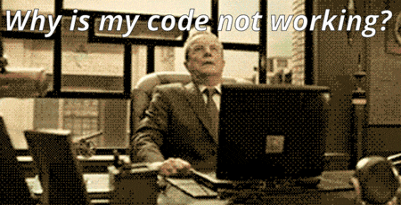
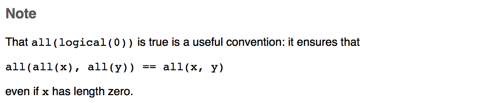
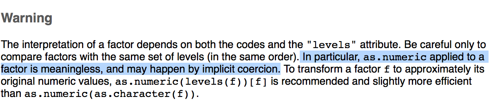

## R can be rewardingly easy to use


## R can be also a source of frustration


## Let's do some simple calculations 
```{r, results='hide'}
options(digits=22)

1.1 - 0.2
```

## Let's do some simple calculations 
```{r}
options(digits=22)

1.1 - 0.2
```

## Let's do some simple calculations 


## Let's do some simple calculations 
```{r}
options(digits=22)

1.1 - 0.2
```
Reason: Machine representation of float (numbers with decimal points)

## Usually differences are negligibly small


## Let's talk about any() and all()
```{r, results='hide'}
all(c())
any(c())
```

## Let's talk about any() and all()
```{r}
any(c())
```

## Let's talk about any() and all()
```{r}
all(c())
```


## Let's talk about any() and all()
Solution in the help file: 


## Factors are super useful!


## Working with factors in R
```{r}
dat <- data.frame(measure = c('6','1', '1', '1', '2','10','4'))
as.numeric(dat$measure)
```

## Working with factors in R
```{r}
str(dat$measure)
```


## R is full of (implicit) coercion


## Implicit coercions is implicit!
```{r}
dat$measure
c(dat$measure, c(22, 1))
```


## Working with factors in R



## require('bananas') vs library('bananas')
```{r, eval=FALSE}
require('bananas')
library('bananas')
```

## require('bananas') vs library('bananas')
```{r, error=TRUE}
require('bananas')
library('banana')
```
=> Use library in most cases

## require('bananas') vs library('bananas')
```{r, warning=FALSE, message=FALSE}
x <- require('bananas')
x
```

```{r, eval=FALSE}
if(!x){
  install.packages('banana')
}
```

## require('bananas') vs library('bananas')


## <- vs = 
```{r}
x <- 1
x = 1
```
What's the difference?


## <- vs = 
In practice same functionality. 

```{r}
mean(new_var <- c(1,2))
new_var
```
## What about <<- ?
```{r}
var = 1
fun = function(x){var <<- x}
fun(2)
var
```


## Some advice
- R help is helpful, use it!
- Nice FAQ!

## Meta facts about the talk:

- Slides down with knitr+RMarkdown+ioslides
- Slides on Github: https://github.com/christophM/r-y-u-do-dis
- Time spent: 
    - 20% on content and practicing
    - 80% on choosing the memes

# Thanks!
